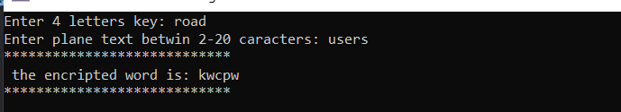
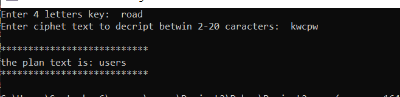
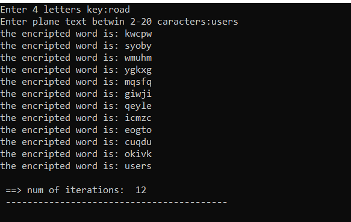

# Emulator-hill-cipher-example-2x2-encryption-and-decryption-in-c
 The Hill Cipher uses an area of mathematics called Linear Algebra, and in particular requires the user to have an elementary understanding of matrices.
 or example, we use the word "road" to build our key (matrix 2x2) and plan text the word " users": 
 # encryption: 

# decryption: 

and as we know h\Hill cipher is linear cipher , so with iterative encryption we will get the plan text: 

